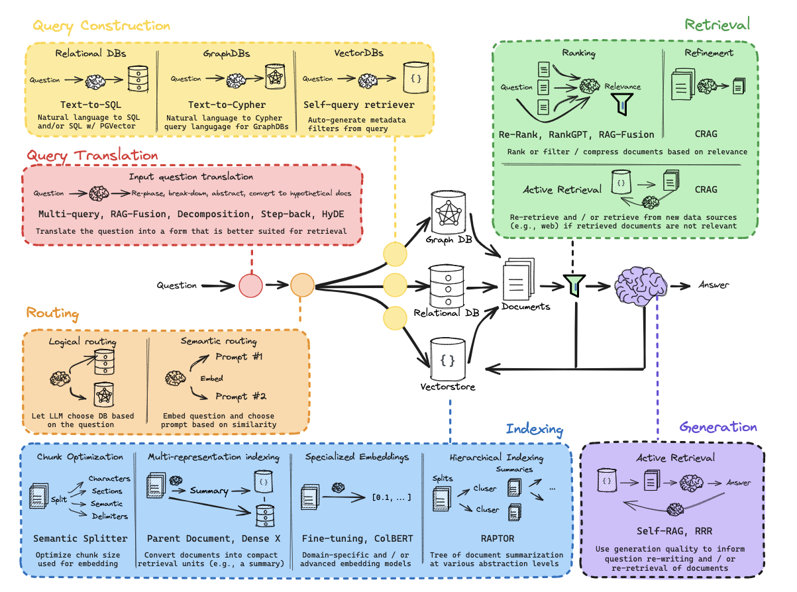

# Query Translation
RAG工作流的第一阶段，接收用户输入的问题，以某种方式将其转化为提高检索效果的形式。因为用户的问题可能模棱两可，质量良莠不齐，我们在执行向量检索时不能召回很好的结果。

## Query Decomposition
查询分解中通常有这样三种方式进行查询转换，事实上往往会综合使用：
- Step-back question：将问题转换为更高层级的更抽象的问题。

    **通过将问题回退到一个更高层级的抽象问题，可以扩大检索范围，增加召回相关文档的可能性；在检索到相关文档后，可以进一步细化查询，找到更具体的答案。**

    **首先采用few_shot暗示大模型根据原始问题返回step—back问题，再将step-back问题retrieval得到的context和原始问题retrieval得到的context都融入prompt，合起来形成整体的context，然后再提出原始问题，请求回答。**

- Re-written：将问题同级重写（RAG-Fusion，Multi-Query）。

    **经典的Shotgun Approach核心思想就是通过​​生成大量可能的查询变体​​，覆盖用户问题的多种表达方式，从而提高检索系统的召回率（Recall）。我们可以通过从不同角度重写问题，可以优化查询的表述方式，使其更符合文档的索引方式。在 ​​RAG-Fusion​​ 中，多个重写后的查询会被并行检索，最终根据倒数秩排序融合结果；在 ​​Multi-Query​​ 中，多个等价查询会被（串行或并行）检索，结果也会被去重合并。前者注重于提高检索的效率和效果，适合于需要针对复杂问题提供精确答案的场景，后者的目标是提高检索的覆盖率，适合需要覆盖广泛信息的场景，尤其是当用户问题涉及多个方面的知识时。**

- Sub-question：将问题分解为更低层级的子问题（Least-to-Most）。

    **用户的问题可能过于复杂或涉及多个方面，直接检索可能导致结果不够精确。通过将问题分解为多个子问题，可以逐步缩小检索范围，找到更具体的答案。常见的子问题分解方法包括 ​​Least-to-Most​​，即从最宽泛的问题开始，逐步细化到最具体的问题。**
    
    **LangChain中的示例的子问题分解方案采用了递进填充式的Prompt，遍历问题列表，每一趟的Prompt由 当前遍历到的子问题 + 历史QA对 + 当前问题的retrieval背景知识 组成；另一种简单的方法则是直接独立运行三个subquery，简单拼接形成带有子问题QA对的Prompt，这种方法没有递进。**

## ​​Pseudo-documents
​Pseudo-documents（伪文档）​​ 是一种在信息检索、自然语言处理（NLP）和推荐系统中常用的概念。在这种方式中，可以通过某种方式生成模拟真实文档的虚拟文档来提高检索效果。
- HyDE：生成一个 ​假设文档​​来增强检索效果，从而解决原始问题在检索过程中可能面临的稀疏性、语义表达不足等问题。

    **非常直观的想法，从问题生成目标假设文本，用这个文本进行retrieval，这可以提高检索的效果，然后将检索结果融入context再提出原始问题。**

# Routing
将Query Translation得到的问题集合导航到合适的数据源。但是宏观上，路由不一定是routing到对应的数据源，你可以将query转发到任何地方（比如一个prompt，不同的个prompt下是不一样的各个数据源的处理链 ），只要这样的pipeline有助于解决你的实际问题。

## Logical Routing
- Basically 将我们维护的数据源信息简单的提供给LLM，让LLM自己推理将这个问题应用到哪一个数据源进行retrieval。

    **让大模型理解问题，生成结构化输出，用结构化输出构建不同的分支导向不同的处理链。**

## Semantic Routing
- 一种简单的方法是为不同领域的问题设计不同的Prompt，然后将Prompt向量化，与问题计算相似度，选取最相似的Prompt根据问题构建查询。

## More
- 事实上这两种可以混合使用，在规则明确时依赖逻辑路由，在语义复杂时依赖语义路由。

# Query Construction
将自然语言转化为某个特定领域的特定源的处理语言（Text2SQL、Text2Cypher等等）。
- 其实就是让LLM根据Query的自然语言，提取其中用于Filter的关键信息字段，并使用结构化输出来让这些信息可以轻松的引用和调用，再构建实际查询操作。

# Indexing